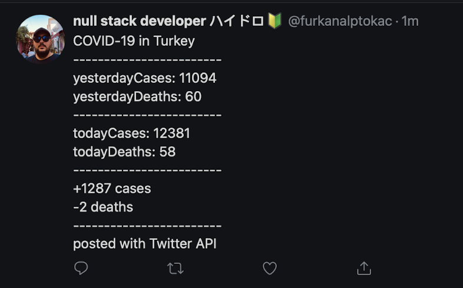

# twitter-api-covid

A bot that tweets daily Covid-19 cases and deaths of Turkey everyday at 21:00 by default. Data from https://covid19.saglik.gov.tr/

**!!** Before using, update yesterday's case and death info in the ```yesterday.json``` file.

Sample tweet:



**Note:** I can't fix the ```Error: Uncaught [ReferenceError: $ is not defined]``` error. But it works.

No licence, feel free to use and improve.